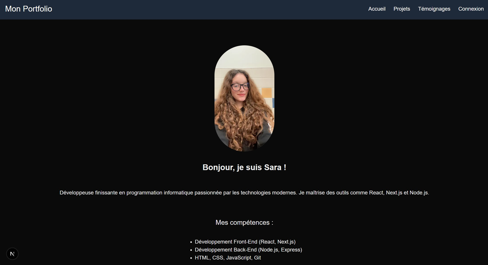
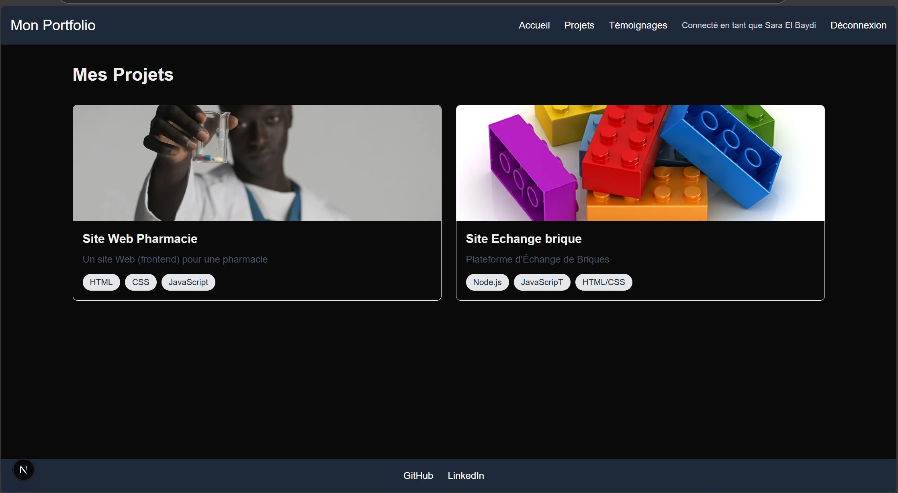
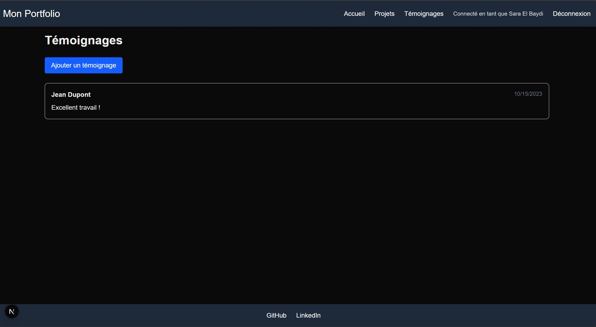
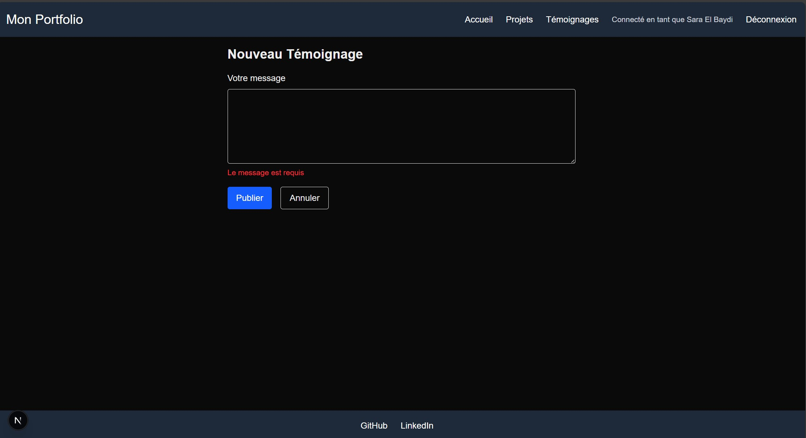
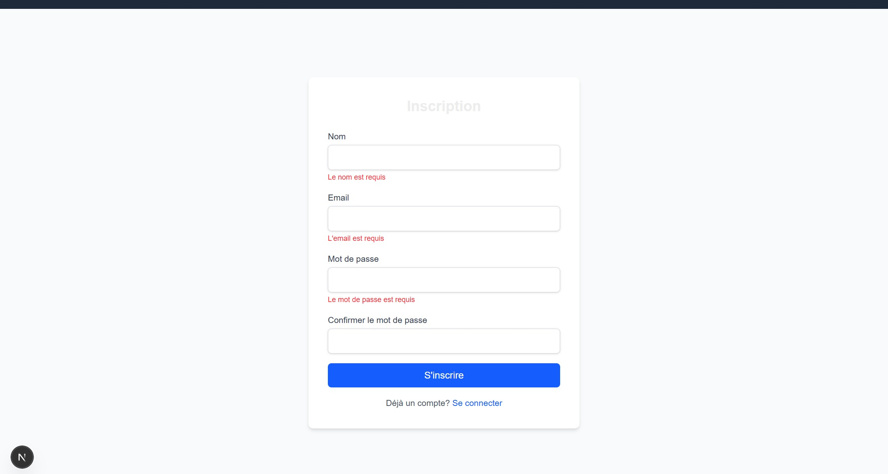

# Portfolio Personnel
Ce projet a pour but de créer un portfolio qui pourra servir de preuve de compétences lors de la recherche d’emploi ou pour d’autres raisons. Il est entièrement construit avec Next.js et inclut plusieurs fonctionnalités telles que des pages de projets, des formulaires d'inscription et de login, ainsi que des pages de témoignages.

# Constitution du projet
Le projet est un portfolio personnel et inclut des informations et une apparence personnalisées pour chaque utilisateur. Voici les éléments inclus dans le projet :

- Une page d'accueil avec une photo, une brève présentation de mes compétences.
- Un entête permettant de naviguer facilement vers les différentes pages du portfolio.
- Un pied de page avec des liens vers mes profils GitHub, LinkedIn, etc.
- Des pages de projets détaillant mes projets passés, avec des descriptions et une liste des technologies utilisées.
- Des pages de formulaire d'inscription et de login, liées à Redux pour la gestion de l'état, permettant uniquement aux utilisateurs inscrits d'accéder aux pages protégées.
- Des pages de témoignages où les visiteurs peuvent laisser, modifier et voir des témoignages, avec une gestion via Redux.

# Aperçu de mon portfolio
- Page d'accueil :
  

- Page de projets (accessible qu'aux utilisateurs connectes) :

- Page de temoignages (accessible qu'aux utilisateurs connectes) :

- Formulaire d'ajout d'un nouveau temoignage :
 

- Formulaire d'inscription (avec validation) :

